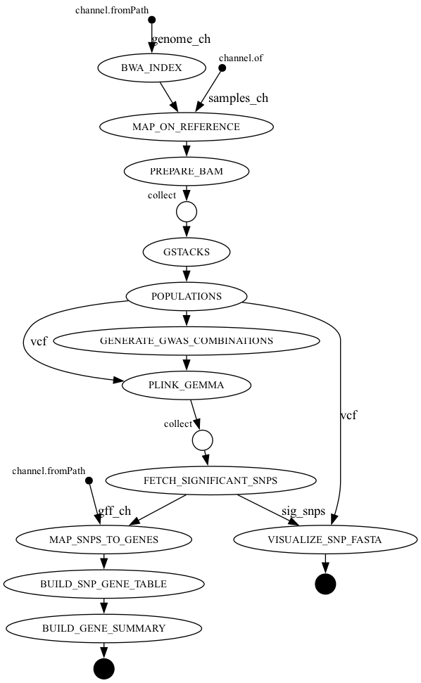

# Genome analysis pipeline for Corn Snake traits

GWAS (Genome-Wide Association Study) pipeline for corn snake morphs (e.g. AMEL, HYPO, LVD).

## What it does

1. **Alignment** – map reads to the reference genome with BWA (`501_map_on_reference.sh`), then prepare/sort BAM files (`502_prepare_bam.sh`).
2. **Variant calling** – build loci with Stacks `gstacks`/`populations` (`503`, `504`) and/or GATK (`201`, `202`).
3. **Filtering** – convert to PLINK format and filter genotypes (`505_plink.sh`).
4. **GWAS** – run association tests with GEMMA (`506_gemma.sh`, `506_run_gemma.py`) per morph/feature (`304_gwas_per_features_*.sh`).
5. **Post-processing** – extract significant loci, fetch nearby/direct genes, build summary tables and sequence visualizations (`507*`, `5071*`–`5074*`).

Scripts are Slurm batch jobs (`#SBATCH`) intended to run on an HPC cluster, plus Python helpers for parsing/annotation.
